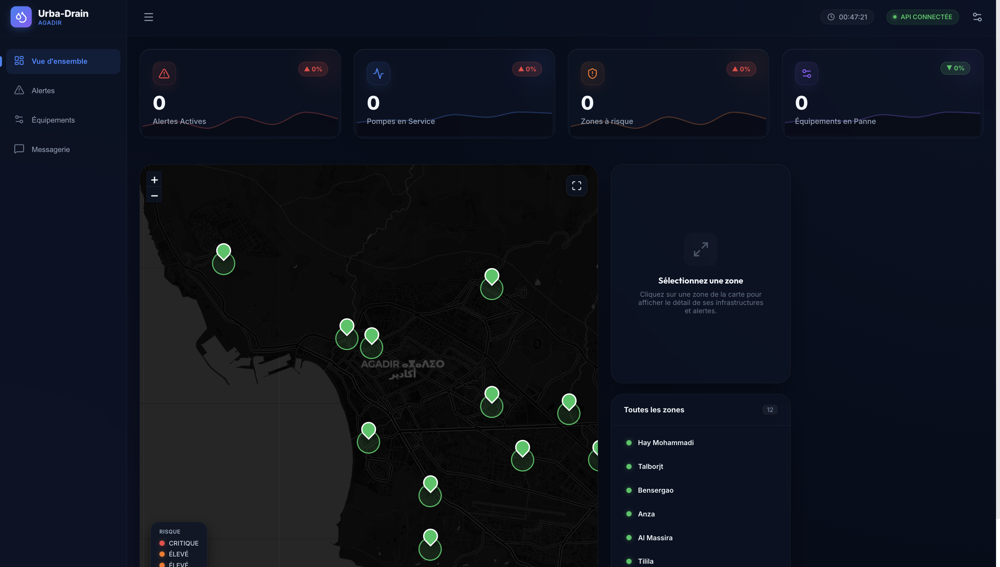
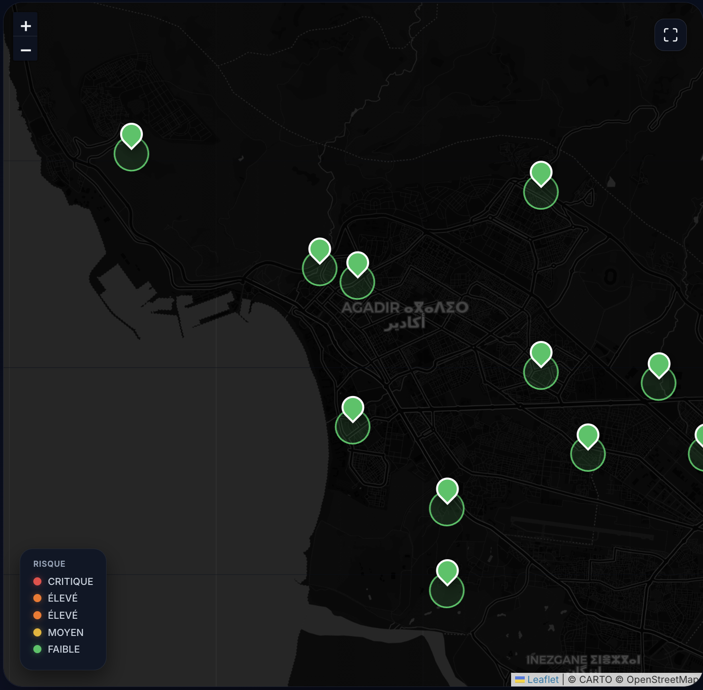

# Urba-Drain Agadir 🌊
> **Unified Smart City Network for Stormwater Management & Flood Prevention.**

[]()
[]()
[]()

**Urba-Drain Agadir** is an advanced Smart City platform designed to monitor, manage, and secure urban stormwater drainage. Developed with a focus on Data Science and AI, this system provides real-time visibility into the city's drainage health, automates emergency responses, and keeps citizens informed through intelligent alerting systems.

---

## 🌍 Real-World Context

This project simulates a real urban drainage control system, combining real-time monitoring, automated response, and decision support for city infrastructure resilience.

---

## 🚀 Key Features

- **📡 Real-Time Monitoring**: Live tracking of multiple urban drainage zones with dynamic risk assessment.
- **⚠️ Dynamic Risk Levels**: Intelligent categorization of risk: `FAIBLE` | `MOYEN` | `ELEVE` | `CRITIQUE`.
- **🛠️ Automated Maintenance (Auto-Healing)**: The system automatically detects anomalies (e.g., critical water levels without alerts) and generates technical warnings or activates pumps.
- **⚙️ Pump Management**: Centralized control of urban pumps with live failure detection and technician notification.
- **📩 Smart City Citizen Alerts**: Automated email notification system that alerts residents when their specific zone enters a `CRITIQUE` or `ELEVE` state.
- **🛡️ Secure RBAC**: Strict Role-Based Access Control (Admin, Technician, Lecturer) enforced via JWT.
- **📈 Analytical Dashboard**: Premium UI featuring maps, real-time KPIs, and trend analysis.
- **⛈️ Multi-Scenario Simulation**: Built-in tools for simulating storms, floods, and recession cycles to test platform resilience.

---

## 🏗️ Architecture

The platform follows a modern decoupled architecture:

- **Frontend**: Single Page Application (SPA) built with **React** and **Vite**, utilizing **Lucide React** for icons and **Recharts** for data visualization.
- **Backend**: Robust REST API powered by **Flask** (Python), utilizing **SQLAlchemy** (ORM) for data management and **JWT** for secure session handling.
- **Database**: Relational **MySQL** schema optimized for high-integrity logging and real-time state synchronization.

---

## 📸 Screenshots


Dashboard overview


Map and zone monitoring interface

---

## 🛠️ Installation Guide

### 1. Prerequisites
- Python 3.8+
- Node.js 16+
- MySQL Server 8.0+

### 2. Database Setup
1. Create a MySQL database named `urba_drain_agadir`.
2. Import the logic schema:
   ```bash
   mysql -u root -p urba_drain_agadir < database/schema/01_create_tables.sql
   mysql -u root -p urba_drain_agadir < database/schema/02_create_citoyens.sql
   ```
3. Load procedures and triggers:
   ```bash
   mysql -u root -p urba_drain_agadir < database/triggers/01_trg_creation_logs.sql
   ```

### 3. Backend Setup
1. Navigate to the backend directory:
   ```bash
   cd backend
   ```
2. Create and activate a virtual environment:
   ```bash
   python -m venv venv
   source venv/bin/activate  # On Windows: venv\Scripts\activate
   ```
3. Install dependencies:
   ```bash
   pip install -r requirements.txt
   ```
4. Configure environment variables in a `.env` file (Database credentials, JWT Secret).

### 4. Frontend Setup
1. Navigate to the frontend directory:
   ```bash
   cd frontend
   ```
2. Install dependencies:
   ```bash
   npm install
   ```

---

---

## 🚦 How to Run

### 1. Backend (Logic & API)
```bash
# Activate environment
cd backend
source venv/bin/activate

# Launch Flask server
python run.py
```
> [!TIP]
> Make sure your MySQL server is running and the `.env` file is properly configured with your database credentials.

### 2. Frontend (Dashboard)
```bash
cd frontend
npm run dev
```
> [!NOTE]
> Open `http://localhost:3000` in your browser. The dashboard will automatically synchronize with the backend state.

---

## 🔐 Default Access & RBAC

| Role | Email | Password |
| :--- | :--- | :--- |
| **Administrator** | `admin@urba-drain-agadir.ma` | `admin123` |
| **Operator** | `operateur@urba-drain-agadir.ma` | `admin123` |
| **Technician** | `technicien@urba-drain-agadir.ma` | `admin123` |
| **Lecturer** | `lecteur@urba-drain-agadir.ma` | `admin123` |

---

## 📬 Smart City Feature: Citizen Alerts

Urba-Drain integrates an automated communication layer for public safety:
- **Automatic**: When a zone's level escalates to `CRITIQUE`, an email is immediately dispatched to all registered citizens in that zone.
- **Anti-Spam Logic**: A daily incident token ensures citizens receive only **one alert per risk level per day**, preventing notification fatigue.
- **Admin Control**: From the **Smart City Connect** tab, administrators can manually trigger urgent notifications to specific neighborhoods.

---

## 🧪 Testing the System

To verify the platform's reactive logic:
1. **Login** as an Administrator.
2. Go to the **Simulation Panel**.
3. Choose a zone (e.g., Tilila) and set **Intensité de l'orage** to **90%**.
4. Observe:
    - Real-time update of KPIs.
    - Automatic generation of a `CRITIQUE` alert.
    - Simulated email notification logged in the backend terminal.
    - Automatic activation of the zone's pumps.

---

## 📂 Project Structure

```text
urba-drain-agadir/
├── backend/                # Flask API
│   ├── app/                # Main application logic
│   │   ├── models/         # SQLAlchemy Models
│   │   ├── routes/         # Blueprints & Endpoints
│   │   └── services/       # Email & Logic hooks
│   └── run.py              # Entry point
├── frontend/               # React Application
│   ├── src/                # Source code
│   │   ├── components/     # Reusable UI components
│   │   └── pages/          # Dashboard views
│   └── vite.config.js
├── database/               # SQL Scripts
│   ├── schema/             # Tables & Constraints
│   └── procedures/         # Stored Procedures (Storm Logic)
└── docs/                   # Unified Documentation (MCD/MLD/Audit)
```

---

## 🔮 Future Improvements

- **AI Forecasting**: Integration of time-series models to predict flooding *before* it occurs based on meteorological data.
- **IoT Expansion**: Support for multi-sensor hardware (LoRaWAN) for ultra-low power monitoring.
- **Mobile App**: Dedicated Flutter app for field technicians and citizen reporting.

---

## 👥 Team: Augmenteds (AI-driven development)

This project was developed as part of the **Souss-Massa Resilience Prototype 2026** within the **Augmenteds** (AI-driven development) sub-team.

- **Abdelaali Belaajin** — Lead Developer / System Design / AI Integration
  - [GitHub](https://github.com/abdelaali-belaajin) | [LinkedIn](https://www.linkedin.com/in/abdelaali-belaajin)
- **Chadi Belhadj** — Contributor (Development)
- **Mohamed Benelmalih** — Contributor (Development)

---

## 📜 License

This project is licensed under the **MIT License**. See the `LICENSE` file for details.

## 🎥 Démo vidéo
[Voir la vidéo de démonstration](https://drive.google.com/file/d/1HP1QkuV06eJoPk_QwjkY2V00aiL1pLlz/view?usp=sharing)
